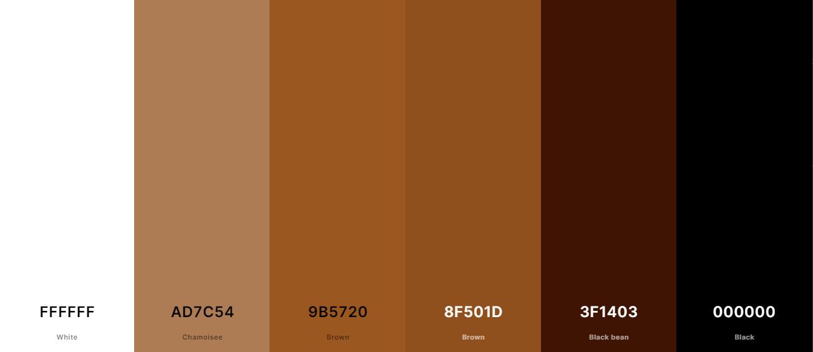
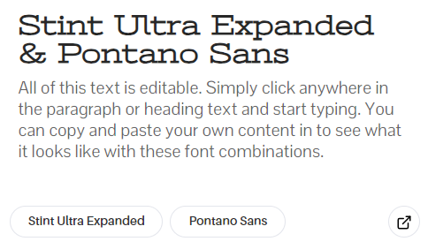
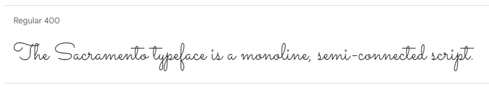

# Come Code with Me - My Coding Journey

"Come Code with Me" is a fictional blog of a Web Application Development student, who shares her coding journey, discoveries, and insights into the tech world. From hackathons and coding challenges to embracing new technologies, she writes about the triumphs and tribulations of her educational odyssey. 

The site consists of three pages: Home (where the blog author introduces herself), Blog (where all the blog posts are located), and Sign In/Out (where you can create a new account or log into the existing one), which is only visible if you're not signed in. If you already have an account and you're currently signed in, the third page you'll be able to see in the navbar will be Sign Out (where you can log out of your account). Adding comments to the blog posts is a functionality only available to registered users.

"Come Code with Me" deployed website is available [here].

## Table of Contents

- [Come Code with Me - My Coding Journey](#come-code-with-me---my-coding-journey)
  - [Table of Contents](#table-of-contents)
  - [User Experience (UX)](#user-experience-ux)
    - [User Stories](#user-stories)
      - [Client Goals](#client-goals)
      - [First Time User Goals](#first-time-user-goals)
      - [Returning/Frequent User Goals](#returningfrequent-user-goals)
  - [Design](#design)
    - [Colour Scheme](#colour-scheme)
    - [Typography](#typography)
    - [Imagery](#imagery)
    - [Wireframes](#wireframes)
    - [Features](#features)
      - [Existing Features](#exisiting-features)
      - [Future Implementations](#future-implementations)
  - [Technologies Used](#technologies-used)
    - [Languages Used](#languages-used)
    - [Frameworks, Libraries and Programs Used](#frameworks-libraries-and-programs-used)
  - [Testing](#testing)
  - [Deployment](#deployment)
    - [Deploying the project to GitHub Pages](#deploying-the-project-to-github-pages)
    - [Forking the GitHub repository](#forking-the-github-repository)
    - [Making a local clone](#making-a-local-clone)
  - [Credits](#credits)
    - [Code](#code)
    - [Content](#content)
    - [Media](#media)
    - [Acknowledgements](#acknowledgements)

## Design

### Colour Scheme

The colour scheme of "Come Code with Me" was derived from its background image and the main home page picture — an AI-generated, animated image of the blog author. Given its crucial role in setting the tone and atmosphere of the site, I aimed for it to mirror the ambiance of late-night coding sessions, often accompanied by a comforting cup of coffee. The dominant black evokes the nocturnal atmosphere, symbolizing the late hours spent immersed in code. White, representing clarity and focus, enhances readability and emphasizes the clean lines of the design. Beige and brown shades evoke the warmth of coffee, providing a sense of comfort during intense coding sessions. Together, these colors create an inviting and cozy environment, inspiring productivity and creativity while capturing the essence of late-night coding rituals.

I used [Coolors](https://coolors.co/ffffff-ad7c54-9b5720-8f501d-3f1403-000000) to generate my colour palette.

### Typography

The combination of well-matching Stint Ultra Expanded and Pontano Sans fonts was suggested by one of the font pairing services called [fontpair.co](https://www.fontpair.co/). These fonts create a great contrast in a harmonising way. They enhance the visual hierarchy of the website and highlight essential information.

The [Stint Ultra Expanded](https://fonts.google.com/specimen/Stint+Ultra+Expanded) is a font designed for digital use, characterized by its expanded letterforms and distinctive appearance. It features wider letterforms compared to standard fonts. This expansion provides a unique visual style that makes it a perfect choice for headings and titles.

The [Pontano Sans](https://fonts.google.com/specimen/Pontano+Sans) is a contemporary sans-serif font that features a clean and modern design with minimalistic letterforms. Pontano Sans prioritizes legibility, making it easy to read even at small sizes. Its balanced proportions, contemporary aesthetic and clean lines ensure clear communication of text. It was used for blog posts' content.

Additionally, a [Sacramento](https://fonts.google.com/specimen/Sacramento) font was introduced specifically for messages directly from the blog author. The selection of this font was deliberate, as it perfectly imitates handwriting and adds a personal touch to the website, which creates a welcoming and approachable tone, making it ideal for conveying the author's thoughts, reflections, and updates in a warm and engaging manner.

[Font Awesome](https://fontawesome.com/) icons were used throughout the site, such as social media icons in the footer, or visual representations of forms' input fields.

## Technologies Used

### Languages Used

- [HTML](https://en.wikipedia.org/wiki/HTML) - used for the main site content.
- [CSS](https://en.wikipedia.org/wiki/CSS) - used for the main site design and layout.
- [JavaScript](https://www.javascript.com) - used for user interaction on the site.
- [Python](https://www.python.org/) - used for backend development.

### Frameworks, Libraries and Programs Used

- [Am I responsive?](https://ui.dev/amiresponsive) - used to check the site's responsiveness and to create mockups.
- [Balsamiq](https://balsamiq.com/wireframes/) - used to create wireframes.
- [Coolors](https://coolors.co/) - used to create the colour palette.
- [Flask](https://flask.palletsprojects.com/en/3.0.x/) - a Python web framework.
- [Font Awesome](https://fontawesome.com/) - used to provide icons across the website.
- [Fontpair](https://www.fontpair.co/all) - used for font pairing.
- [Free Convert](https://www.freeconvert.com/jpg-to-webp) - used to convert jpg/png images to webp format.
- [Google Chrome Dev Tools](https://developer.chrome.com/docs/devtools/) - used to inspect and debug the code.
- [Google Fonts](https://fonts.google.com/) - used to import the fonts that style all of the text content.
- [Git](https://git-scm.com/) - used for version control by utilizing Gitpod's terminal.
- [GitHub](https://github.com/) - used to store the project's code and images in the repository.
- [Gitpod](https://www.gitpod.io/) - used as a code editor.
- [Heroku](https://www.heroku.com/home) - used to deploy the website.
- [Icon-Icons](https://icon-icons.com/) - used to provide the favicon.
- [Jinja](https://jinjapalletsprojects.com/en/3.1.x/) - a web template engine for Python.
- [MaterializeCSS](https://materializecss.com/) - a CSS framework based on Material Design by Google.
- [MongoDB](https://www.mongodb.com/) - a non-relational database used to store blog posts and users' login details.
- [PostImage](https://postimages.org/) - an online image URL generator.
- [PyMongo](https://www.mongodb.com/docs/drivers/pymongo/) - a Python driver for MongoDB.
- [Tiny.png](https://tinypng.com/) - used to reduce the size of the image files.
- [Werkzeug](https://werkzeug.palletsprojects.com/en/3.0.x/) - a WSGI utility library for Python.