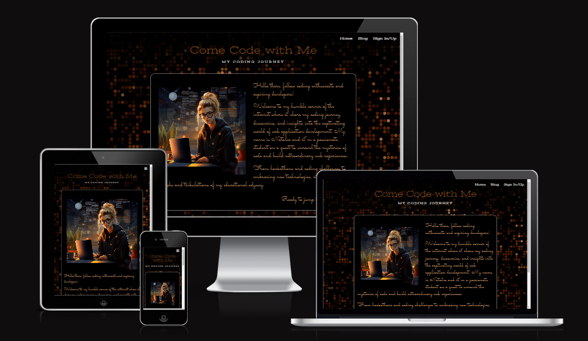
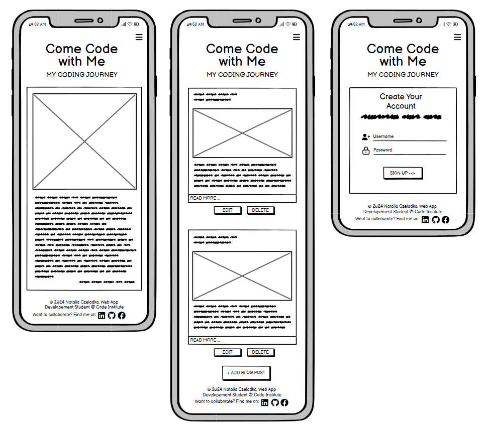
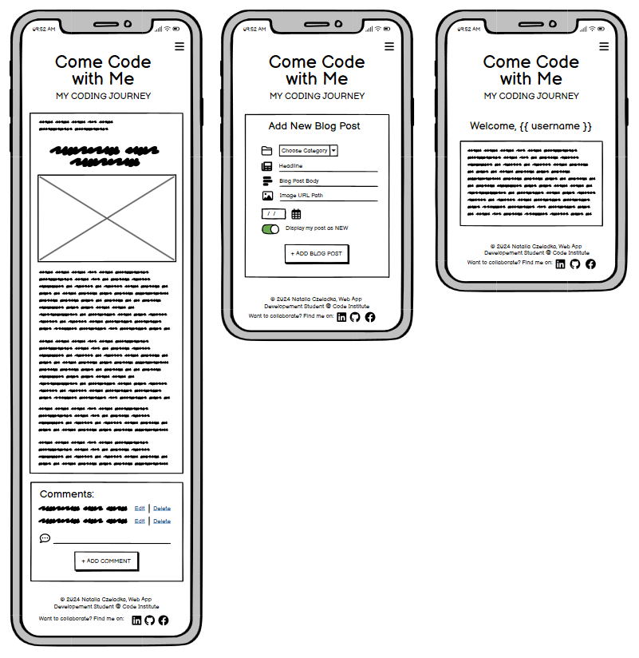
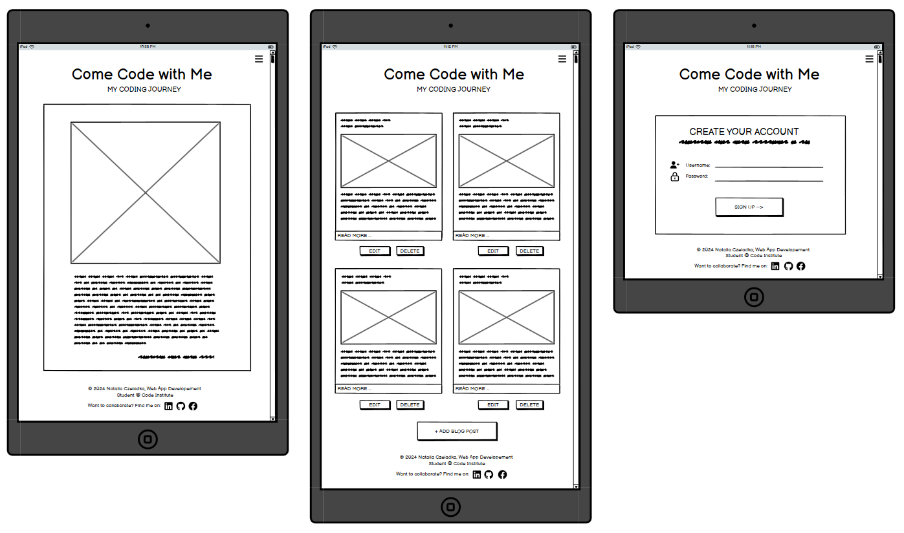
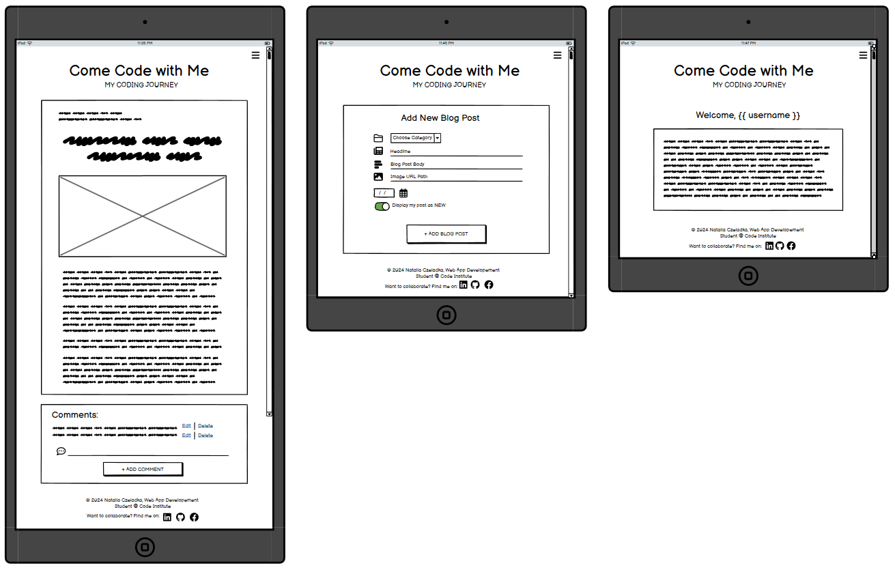
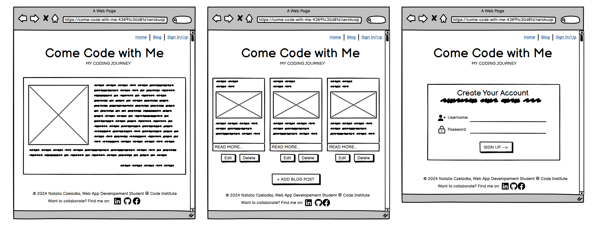
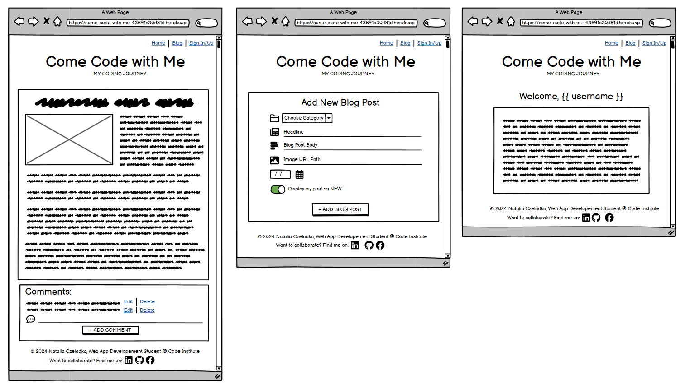

# Come Code with Me - My Coding Journey

"Come Code with Me" is a fictional blog created by a Web Application Development student, who shares her coding journey, discoveries, and insights into the tech world. From hackathons and coding challenges to embracing new technologies, she writes about the triumphs and tribulations of her educational odyssey.

The site consists of three pages: Home (where the blog author introduces herself), Blog (where all the blog posts are located), and Sign In/Up. The Sign In/Up page allows users to create a new account or log into an existing one. If you're already signed in, you'll see the Sign Out option in the navbar, allowing you to log out of your account. Adding comments to blog posts, as well as editing or deleting them, is only available to registered users. Adding new blog posts, editing, and deleting them are functionalities restricted to an admin.



You can access the deployed "Come Code with Me" website [here](https://come-code-with-me-43691c30d81d.herokuapp.com/home).

## User Experience (UX)

### User Stories

#### Client Goals

- To document their coding journey, track their progress, and reflect on their experiences as they learn and grow in web app development.
- To showcase their personal projects and coding challenges to demonstrate their skills, creativity, and problem-solving abilities to potential employers, collaborators, and the broader tech community.
- To share their insights and discoveries in web app development and emerging technologies with others in the field, contributing to the community and encouraging knowledge exchange.
- To connect with other students, developers, mentors, and professionals in the tech industry, fostering meaningful relationships, mentorship, and potential collaboration on projects or initiatives.
- To seek feedback, advice, and support from their audience, peers, and mentors to improve their coding skills, overcome challenges, and navigate their career path in web app development effectively.
- To inspire and motivate other aspiring developers by sharing their experiences, successes, failures, and lessons learned along their coding journey.
- To build and enhance their personal brand as a competent and passionate web app developer, showcasing their portfolio, achievements, and expertise to potential employers and collaborators.
- To attract job opportunities, internships, freelance projects, and career advancement opportunities through their blog, using it as a tool to market their skills, experience, and potential to prospective employers and recruiters.
- To promote continuous learning, experimentation, and exploration of new technologies, frameworks, tools, and methodologies in web app development, enabling them to stay updated and adapt to the evolving landscape of the tech industry.
- To deliver all of the above in the form of a visually appealing, intuitive, responsive across different devices and easy to navigate website.

#### First-Time User Goals

- To understand the purpose and focus of the website, including the student's goals, interests, areas of expertise, and the type of content they can expect to find.
- To learn more about the student behind the blog, including their background, interests, skills, achievements, and the story behind their coding journey.
- To connect with the student through social media, or other channels, providing feedback, asking questions, sharing their own experiences, or expressing interest in potential collaborations.
- To find inspiration, insights, and valuable information that can help them learn more about web app development, coding best practices, new technologies, and industry trends.
- To access resources, tools, tutorials, guides, and other educational materials that can help them improve their coding skills, learn new technologies, and advance their careers in web app development.
- To navigate throughout the page and access relevant content in an easy, effortless and intuitive way.
- To interact with the website's content seamlessly across different devices and screen sizes.
- To have a positive and enjoyable experience while browsing the website.

#### Returning User Goals

- To access new blog posts, projects, articles, or updates since their last visit.
- To engage continuously with the website's content by commenting on blog posts, asking questions, or participating in discussions related to coding topics and industry trends.
- To offer feedback based on their experiences, helping to shape future updates and improvements.

#### Frequent User Goals

- To stay updated with the latest content, projects, and insights shared by the student on their coding journey.
- To stay connected with the student and the community around the blog, including subscribing to newsletters, following social media updates, or joining forums or groups related to web app development.
- To find solutions to specific coding challenges, troubleshoot issues, or learn new techniques and strategies in web app development based on their ongoing projects or interests.
- To provide feedback, suggestions, or recommendations to help improve the website's content, user experience, navigation, or functionality, contributing to its continuous improvement and development.

## Design

### Colour Scheme

The colour scheme of "Come Code with Me" was derived from its background image and the main home page picture — an AI-generated, animated image of the blog author. Given its crucial role in setting the tone and atmosphere of the site, I aimed for it to mirror the ambiance of late-night coding sessions, often accompanied by a comforting cup of coffee. The dominant black evokes the nocturnal atmosphere, symbolizing the late hours spent immersed in code. White, representing clarity and focus, enhances readability and emphasizes the clean lines of the design. Beige and brown shades evoke the warmth of coffee, providing a sense of comfort during intense coding sessions. Together, these colors create an inviting and cozy environment, inspiring productivity and creativity while capturing the essence of late-night coding rituals.

I used [Coolors](https://coolors.co/ffffff-ad7c54-9b5720-8f501d-3f1403-000000) to generate my colour palette.


### Typography

The combination of well-matching Stint Ultra Expanded and Pontano Sans fonts was suggested by one of the font pairing services called [fontpair.co](https://www.fontpair.co/). These fonts create a great contrast in a harmonising way. They enhance the visual hierarchy of the website and highlight essential information.

The [Stint Ultra Expanded](https://fonts.google.com/specimen/Stint+Ultra+Expanded) is a font designed for digital use, characterized by its expanded letterforms and distinctive appearance. It features wider letterforms compared to standard fonts. This expansion provides a unique visual style that makes it a perfect choice for headings and titles.

The [Pontano Sans](https://fonts.google.com/specimen/Pontano+Sans) is a contemporary sans-serif font that features a clean and modern design with minimalistic letterforms. Pontano Sans prioritizes legibility, making it easy to read even at small sizes. Its balanced proportions, contemporary aesthetic and clean lines ensure clear communication of text. It was used for blog posts' content.


Additionally, a [Sacramento](https://fonts.google.com/specimen/Sacramento) font was introduced specifically for messages directly from the blog author. The selection of this font was deliberate, as it perfectly imitates handwriting and adds a personal touch to the website, which creates a welcoming and approachable tone, making it ideal for conveying the author's thoughts, reflections, and updates in a warm and engaging manner.


[Font Awesome](https://fontawesome.com/) icons were used throughout the site, such as social media icons in the footer, or visual representations of forms' input fields.

### Imagery

Images play a crucial role in enhancing the overall user experience, making the content more engaging. However, the website currently features only two: the background picture and the animated representation of the blog owner on the home page. This limitation stems from the fact that each blog post will include a featured image, added by the blog owner while composing the remaining content, to represent its main topic. Such images will be showcased in both blog post previews and the full post pages.

The background picture was sourced from the leading provider of stock photography, [Shutterstock](https://www.shutterstock.com/).


The animated image of the blog owner was AI-generated using [Midjourney](https://www.midjourney.com/home?callbackUrl=%2Fexplore).


### Wireframes

Wireframes were created using [Balsamiq](https://balsamiq.com/wireframes/) - the industry's top wireframing software.

| Size | Screenshot |
| --- | --- |
| Mobile |  |
| Tablet |  |
| Desktop |  |


## Technologies Used

### Languages Used

- [HTML](https://en.wikipedia.org/wiki/HTML) - used for the main site content.
- [CSS](https://en.wikipedia.org/wiki/CSS) - used for the main site design and layout.
- [JavaScript](https://www.javascript.com) - used for user interaction on the site.
- [Python](https://www.python.org/) - used for backend development.

### Frameworks, Libraries and Programs Used

- [Am I responsive?](https://ui.dev/amiresponsive) - used to check the site's responsiveness and to create mockups.
- [Balsamiq](https://balsamiq.com/wireframes/) - used to create wireframes.
- [Coolors](https://coolors.co/) - used to create the colour palette.
- [Flask](https://flask.palletsprojects.com/en/3.0.x/) - a Python web framework.
- [Font Awesome](https://fontawesome.com/) - used to provide icons across the website.
- [Fontpair](https://www.fontpair.co/all) - used for font pairing.
- [Free Convert](https://www.freeconvert.com/jpg-to-webp) - used to convert jpg/png images to webp format.
- [Google Chrome Dev Tools](https://developer.chrome.com/docs/devtools/) - used to inspect and debug the code.
- [Google Fonts](https://fonts.google.com/) - used to import the fonts that style all of the text content.
- [Git](https://git-scm.com/) - used for version control by utilizing Gitpod's terminal.
- [GitHub](https://github.com/) - used to store the project's code and images in the repository.
- [Gitpod](https://www.gitpod.io/) - used as a code editor.
- [Heroku](https://www.heroku.com/home) - used to deploy the website.
- [Icon-Icons](https://icon-icons.com/) - used to provide the favicon.
- [Jinja](https://jinjapalletsprojects.com/en/3.1.x/) - a web template engine for Python.
- [MaterializeCSS](https://materializecss.com/) - a CSS framework based on Material Design by Google.
- [MongoDB](https://www.mongodb.com/) - a non-relational database used to store blog posts and users' login details.
- [PostImage](https://postimages.org/) - an online image URL generator.
- [PyMongo](https://www.mongodb.com/docs/drivers/pymongo/) - a Python driver for MongoDB.
- [Tiny.png](https://tinypng.com/) - used to reduce the size of the image files.
- [Werkzeug](https://werkzeug.palletsprojects.com/en/3.0.x/) - a WSGI utility library for Python.

## Database Design

My project uses a non-relational database with MongoDB, and therefore the database architecture
doesn't have actual relationships like a relational database would.

My database is called **coding_blog**.

It contains 4 collections:

- **categories**
    | Key | Type | Notes |
    | --- | --- | --- |
    | _id | ObjectId() | |
    | category_name | String | |

- **blog_posts**
    | Key | Type | Notes |
    | --- | --- | --- |
    | _id | ObjectId() | |
    | category_name | String | selected from *categories* collection |
    | headline | String | |
    | post_body | String | |
    | image_url | String | |
    | date_created | String | |
    | is_new | String | |

- **users**
    | Key | Type | Notes |
    | --- | --- | --- |
    | _id | ObjectId() | |
    | username | String | |
    | password | String | uses Secure Hash Algorithm (SHA) |

- **comments**
    | Key | Type | Notes |
    | --- | --- | --- |
    | _id | ObjectId() | |
    | comment_content | String | |
    | blog_post_id | ObjectId() | selected from *blog_posts* collection |
    | password | String | uses Secure Hash Algorithm (SHA) |

## Testing

For all testing, please refer to the [TESTING.md](TESTING.md) file.

## Deployment

The live deployed application can be found deployed on [Heroku](https://come-code-with-me-43691c30d81d.herokuapp.com).

### MongoDB Non-Relational Database

This project uses [MongoDB](https://www.mongodb.com) for the Non-Relational Database.

To obtain your own MongoDB Database URI, sign-up on their site, then follow these steps:

- The name of the database on MongoDB should be called **coding_blog**.
- The collections needed for this database should be **categories**, **blog_posts**, **users** and **comments**.
- Click on the **Cluster** name created for the project.
- Click on the **Connect** button.
- Click **Connect Your Application**.
- Copy the connection string, and replace `password` with your own password (also remove the angle-brackets).

### Heroku Deployment

This project uses [Heroku](https://www.heroku.com), a platform as a service (PaaS) that enables developers to build, run, and operate applications entirely in the cloud.

Deployment steps are as follows, after account setup:

- Select **New** in the top-right corner of your Heroku Dashboard, and select **Create new app** from the dropdown menu.
- Your app name must be unique, and then choose a region closest to you (EU or USA), and finally, select **Create App**.
- From the new app **Settings**, click **Reveal Config Vars**, and set your environment variables.

| Key | Value |
| --- | --- |
| `DATABASE_URL` | user's own value |
| `IP` | 0.0.0.0 |
| `MONGO_DBNAME` | user's own value |
| `MONGO_URI` | user's own value |
| `PORT` | 5000 |
| `SECRET_KEY` | user's own value |

Heroku needs two additional files in order to deploy properly.

- requirements.txt
- Procfile

You can install this project's **requirements** (where applicable) using:

- `pip3 install -r requirements.txt`

If you have your own packages that have been installed, then the requirements file needs updated using:

- `pip3 freeze --local > requirements.txt`

The **Procfile** can be created with the following command:

- `echo web: python app.py > Procfile`
- *replace **app.py** with the name of your primary Flask app name; the one at the root-level*

For Heroku deployment, follow these steps to connect your own GitHub repository to the newly created app:

Either:

- Select **Automatic Deployment** from the Heroku app.

Or:

- In the Terminal/CLI, connect to Heroku using this command: `heroku login -i`
- Set the remote for Heroku: `heroku git:remote -a app_name` (replace *app_name* with your app name)
- After performing the standard Git `add`, `commit`, and `push` to GitHub, you can now type:
	- `git push heroku main`

The project should now be connected and deployed to Heroku!

### Local Deployment

This project can be cloned or forked in order to make a local copy on your own system.

For either method, you will need to install any applicable packages found within the *requirements.txt* file.

- `pip3 install -r requirements.txt`.


You will need to create a new file called `env.py` at the root-level,
and include the same environment variables listed above from the Heroku deployment steps, plus a few extras.

Sample `env.py` file:

```python
import os

os.environ.setdefault("IP", "0.0.0.0")
os.environ.setdefault("MONGO_DBNAME", "user's own value")
os.environ.setdefault("MONGO_URI", "user's own value")
os.environ.setdefault("PORT", "5000")
os.environ.setdefault("SECRET_KEY", "user's own value")

# local environment only (do not include these in production/deployment!)
os.environ.setdefault("DB_URL", "user's own value")
os.environ.setdefault("DEBUG", "True")
os.environ.setdefault("DEVELOPMENT", "True")
```

#### Cloning

You can clone the repository by following these steps:

1. Go to the [GitHub repository](https://github.com/NataliaCzeladka/come-code-with-me) 
2. Locate the Code button above the list of files and click it 
3. Select if you prefer to clone using HTTPS, SSH, or GitHub CLI and click the copy button to copy the URL to your clipboard
4. Open Git shell or Terminal
5. Change the current working directory to the one where you want the cloned directory
6. In your IDE Terminal, type the following command to clone my repository:
	- `git clone https://github.com/NataliaCzeladka/come-code-with-me.git`
7. Press Enter to create your local clone.

Alternatively, if using Gitpod, you can click below to create your own workspace using this repository.

[](https://gitpod.io/#https://github.com/NataliaCzeladka/come-code-with-me)

Please note that in order to directly open the project in Gitpod, you need to have the browser extension installed.
A tutorial on how to do that can be found [here](https://www.gitpod.io/docs/configure/user-settings/browser-extension).

#### Forking

By forking the GitHub Repository, we make a copy of the original repository on our GitHub account to view and/or make changes without affecting the original owner's repository.
You can fork this repository by using the following steps:

1. Log in to GitHub and locate the [GitHub Repository](https://github.com/NataliaCzeladka/come-code-with-me)
2. At the top of the Repository (not top of page) just above the "Settings" Button on the menu, locate the "Fork" Button.
3. Once clicked, you should now have a copy of the original repository in your own GitHub account!