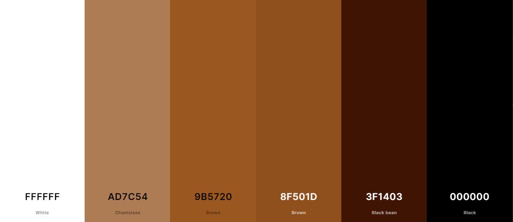

# Come Code with Me - My Coding Journey

"Come Code with Me" is the personal blog of Natalia Czeladka, a Web Application Development student who shares her coding journey, discoveries, and insights into the tech world. From hackathons and coding challenges to embracing new technologies, she writes about the triumphs and tribulations of her educational odyssey. The site consists of three pages: Home (where the blog author introduces herself), Blog (where all the blog posts are located), and Sign In/Out (where you can create a new account or log into the existing one), which is only visible if you're not signed in. If you already have an account and you're currently signed in, the third page you'll be able to see in the navbar will be Sign Out (where you can log out of your account). Adding comments to the blog posts is a functionality only available to registered users.

"Come Code with Me" deployed website is available [here](https://come-code-with-me-43691c30d81d.herokuapp.com/).

## Table of Contents

- [Come Code with Me - My Coding Journey](#come-code-with-me---my-coding-journey)
  - [Table of Contents](#table-of-contents)
  - [User Experience (UX)](#user-experience-ux)
    - [User Stories](#user-stories)
      - [Client Goals](#client-goals)
      - [First Time User Goals](#first-time-user-goals)
      - [Returning/Frequent User Goals](#returningfrequent-user-goals)
  - [Design](#design)
    - [Colour Scheme](#colour-scheme)
    - [Typography](#typography)
    - [Imagery](#imagery)
    - [Wireframes](#wireframes)
    - [Features](#features)
      - [Existing Features](#exisiting-features)
      - [Future Implementations](#future-implementations)
  - [Technologies Used](#technologies-used)
    - [Languages Used](#languages-used)
    - [Frameworks, Libraries and Programs Used](#frameworks-libraries-and-programs-used)
  - [Testing](#testing)
  - [Deployment](#deployment)
    - [Deploying the project to GitHub Pages](#deploying-the-project-to-github-pages)
    - [Forking the GitHub repository](#forking-the-github-repository)
    - [Making a local clone](#making-a-local-clone)
  - [Credits](#credits)
    - [Code](#code)
    - [Content](#content)
    - [Media](#media)
    - [Acknowledgements](#acknowledgements)

## Design

### Colour Scheme

The color scheme of "Come Code with Me" was derived from its background image and the main home page picture — an AI-generated, animated image of the blog author. Given its crucial role in setting the tone and atmosphere of the site, I aimed for it to mirror the ambiance of late-night coding sessions, often accompanied by a comforting cup of coffee. The dominant black evokes the nocturnal atmosphere, symbolizing the late hours spent immersed in code. White, representing clarity and focus, enhances readability and emphasizes the clean lines of the design. Beige and brown shades evoke the warmth of coffee, providing a sense of comfort during intense coding sessions. Together, these colors create an inviting and cozy environment, inspiring productivity and creativity while capturing the essence of late-night coding rituals.

I used [Coolors](https://coolors.co/ffffff-ad7c54-9b5720-8f501d-3f1403-000000) to generate my colour palette.

