# Testing

Return back to the [README.md](README.md) file.

## Code Validation

[The W3C Markup Validation Service](https://validator.w3.org/) and [The W3C CSS Validation Service](https://jigsaw.w3.org/css-validator/) were used to validate every page of the project to ensure there were no syntax errors. The results clearly showed that the website stays in compliance with the standards and recommendations set by the World Wide Web Consortium.

[JSLint](https://www.jslint.com/), a static code analysis tool, was used to check if JavaScript source code complies with coding rules. No errors were found in this area.

### HTML Validation

I have used the recommended [HTML W3C Validator](https://validator.w3.org) to validate all of my HTML files. No errors were found when validating them by URI. 

| Page | W3C URL | Screenshot | Notes |
| --- | --- | --- | --- |
| Home | [W3C](https://validator.w3.org/nu/?doc=https%3A%2F%2Fcome-code-with-me-43691c30d81d.herokuapp.com%2Fhome) |  | Pass: No Errors |
| Sign Up | [W3C](https://validator.w3.org/nu/?doc=https%3A%2F%2Fcome-code-with-me-43691c30d81d.herokuapp.com%2Fsign_up) |  | Pass: No Errors |
| Sign In | [W3C](https://validator.w3.org/nu/?doc=https%3A%2F%2Fcome-code-with-me-43691c30d81d.herokuapp.com%2Fsign_in) |  | Pass: No Errors |
| Welcome | [W3C](https://validator.w3.org/nu/?doc=https%3A%2F%2Fcome-code-with-me-43691c30d81d.herokuapp.com%2Fwelcome%2Fadmin) |  | Pass: No Errors |
| Blog | [W3C](https://validator.w3.org/nu/?doc=https%3A%2F%2Fcome-code-with-me-43691c30d81d.herokuapp.com%2Fget_blog_posts) |  | Pass: No Errors |
| Read Blog Post | [W3C](https://validator.w3.org/nu/?doc=https%3A%2F%2Fcome-code-with-me-43691c30d81d.herokuapp.com%2Fread_post%2F65cff8d14e3349ffe09cee93) |  | Pass: No Errors |
| Add Blog Post | [W3C](https://validator.w3.org/nu/?doc=https%3A%2F%2Fcome-code-with-me-43691c30d81d.herokuapp.com%2Fadd_blog_post) |  | Pass: No Errors |
| Edit Blog Post | [W3C](https://validator.w3.org/nu/?doc=https%3A%2F%2Fcome-code-with-me-43691c30d81d.herokuapp.com%2Fedit_blog_post%2F65cff8d14e3349ffe09cee93) |  | Pass: No Errors |

To properly validate HTML pages with Jinja syntax for authenticated pages, I also utilized the "by input" validation method. It resulted in an error stating: "The `<button>` element must not appear as a descendant of an `<a>` element." It resulted in restructurring the affected buttons accordingly. Additionally, the validation flagged an issue indicating that a `
` element is not allowed as a child of a `` element. However, I chose to disregard this suggestion because there is physically no `
` element within the `` element where the issue was identified. The `
` element serves as a modal displayed upon clicking the `` element.

### CSS Validation

I have used the recommended [CSS Jigsaw Validator](https://jigsaw.w3.org/css-validator) to validate my CSS file. No errors were found.

| File | Jigsaw URL | Screenshot | Notes |
| --- | --- | --- | --- |
| style.css | [Jigsaw](https://jigsaw.w3.org/css-validator) |  | Pass: No Errors |

### JS Hint Testing

I have used [JSHint](https://jshint.com/) to identify potential errors in my JavaScript file. No errors were found.

| File | Screenshot | Notes |
| --- | --- | --- |
| script.js |  | No errors found |

### Python Testing

I have used the recommended [PEP8 CI Python Linter](https://pep8ci.herokuapp.com) to validate my Python file.

| File | Screenshot | Notes |
| --- | --- | --- |
| app.py | 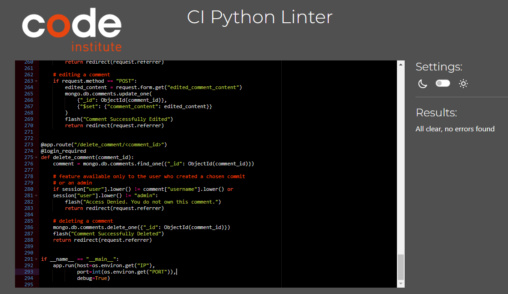 | No errors found |

## Browser Compatibility

I have tested my deployed project on multiple browsers to check for compatibility issues.

| Browser | Screenshot | Notes |
| --- | --- | --- |
| Chrome | 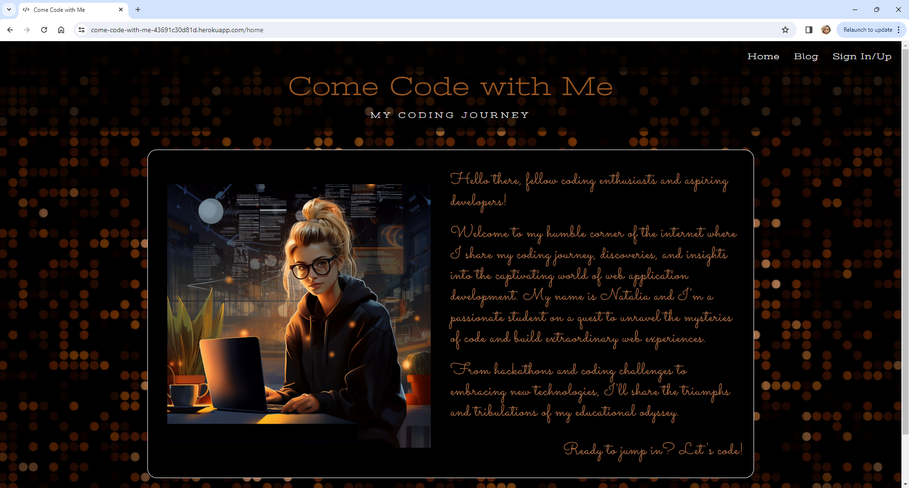 | Works as expected |
| Firefox | 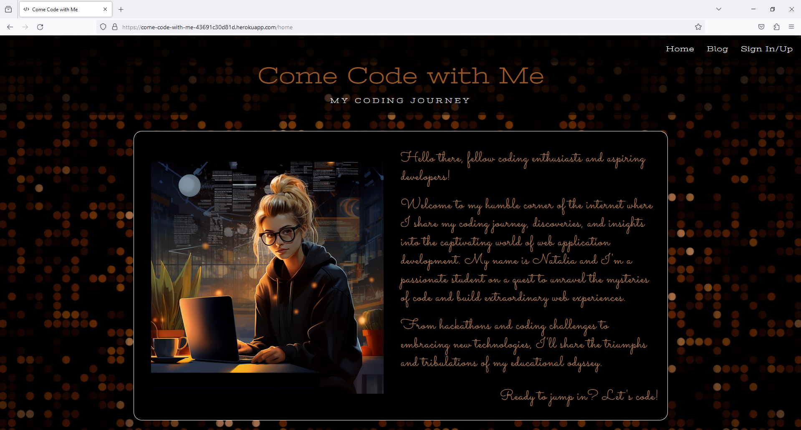 | Works as expected |
| Edge | 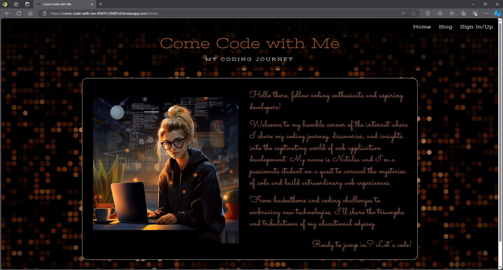 | Works as expected |
| Opera | 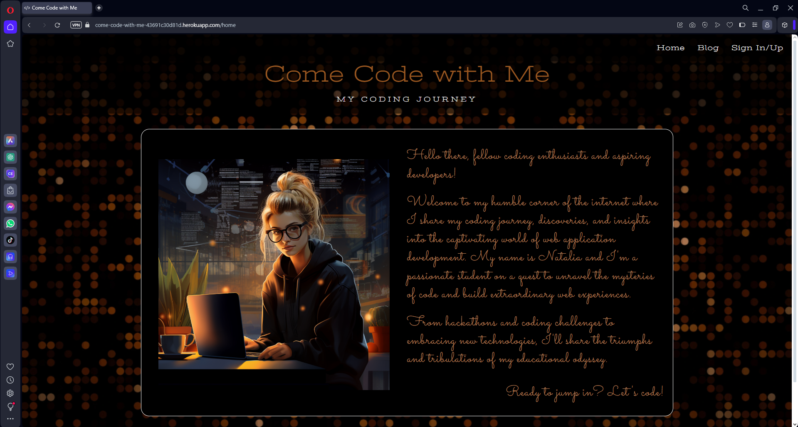 | Works as expected |

## Responsiveness

I have tested my deployed project on multiple devices to check for responsiveness issues. It responds well to different screen sizes ensuring that users can access and navigate the content effortlessly, regardless of their chosen device. No design or functionality issues were found.

| Device | Screenshot 1 | Screenshot 2 | Screenshot 3 | Notes |
| --- | --- | --- | --- | --- |
| Mobile (DevTools) |  | 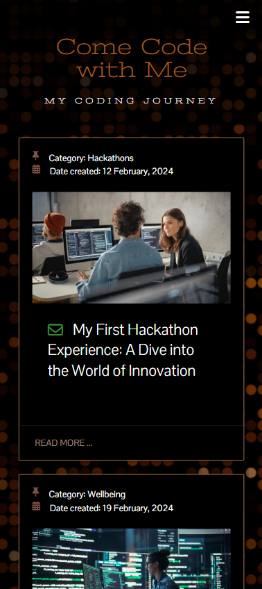 | 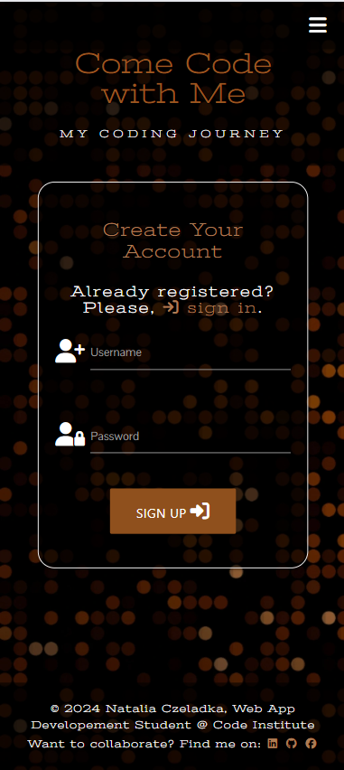 | Works as expected |
| Tablet (DevTools) |  | 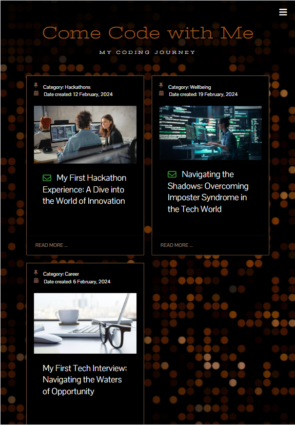 | 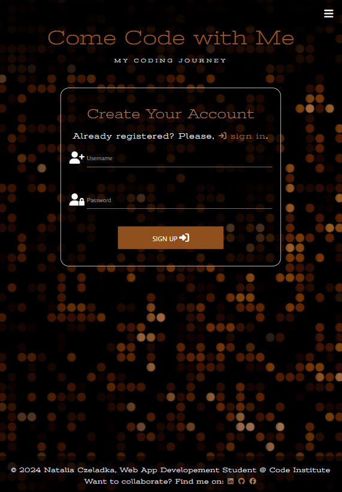 | Works as expected |
| Desktop |  | 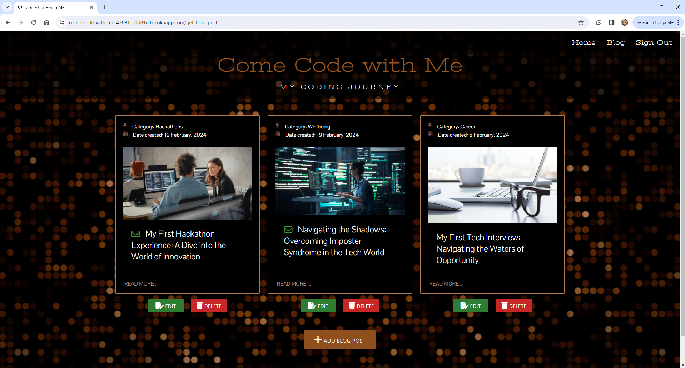 | 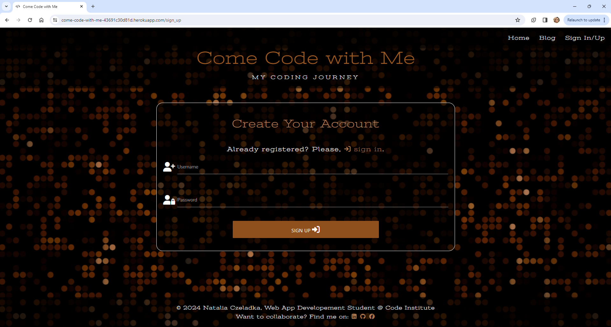 | Works as expected |

## Lighthouse Audit

I have tested my deployed project using the Lighthouse Audit tool to check for any major issues. 

| Page | Size | Screenshot | Notes |
| --- | --- | --- | --- |
| Home | Mobile | 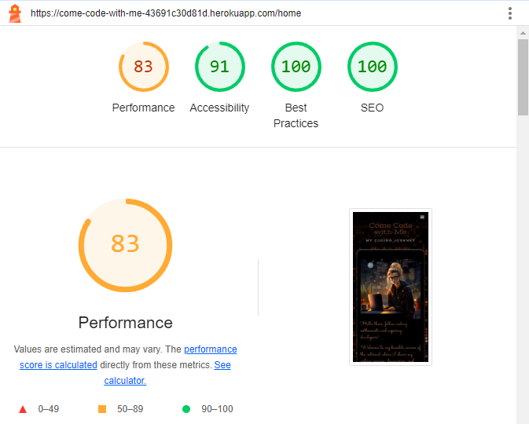 | Few warnings |
| Home | Desktop | 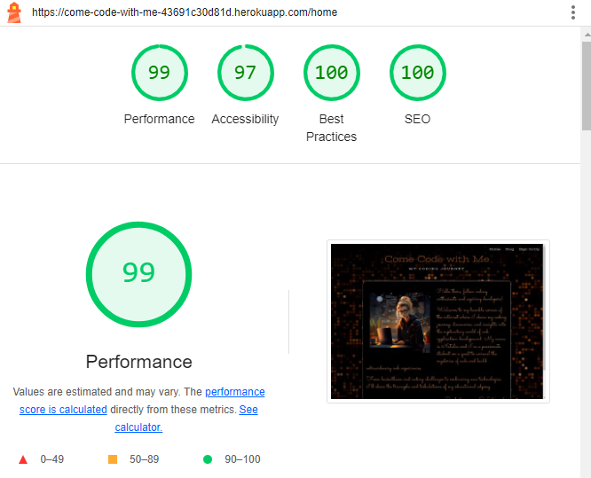 | Some minor warnings |
| Welcome | Mobile | 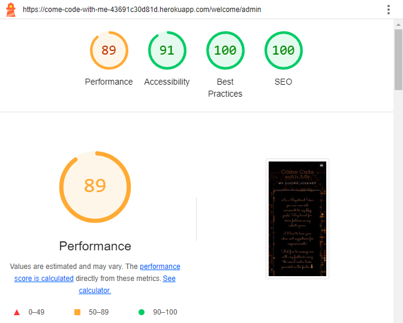 | Few warnings |
| Welcome | Desktop |  | Some minor warnings |
| Sign Up | Mobile | 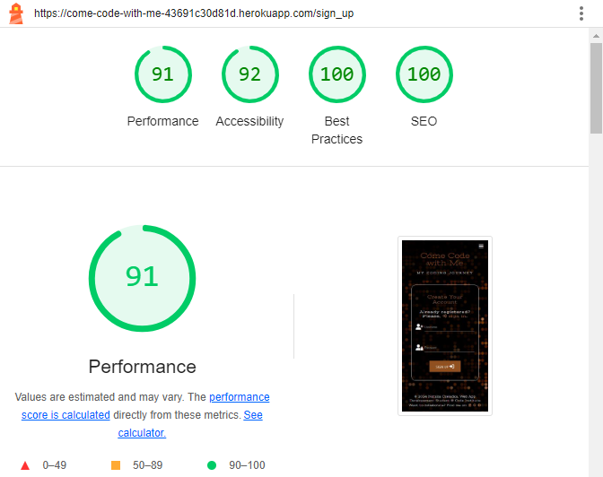 | Some minor warnings |
| Sign Up | Desktop | 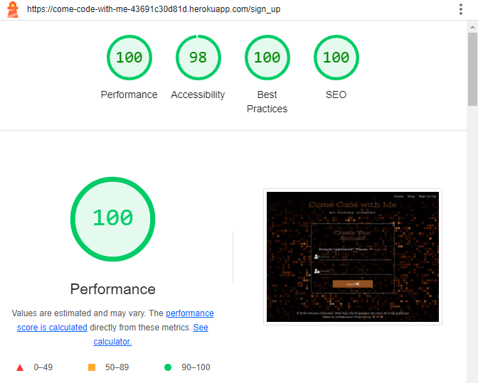 | Some minor warnings |
| Sign In | Mobile |  | Some minor warnings |
| Sign In | Desktop |  | Some minor warnings |
| Blog Posts | Mobile |  | Some minor warnings |
| Blog Posts | Desktop | 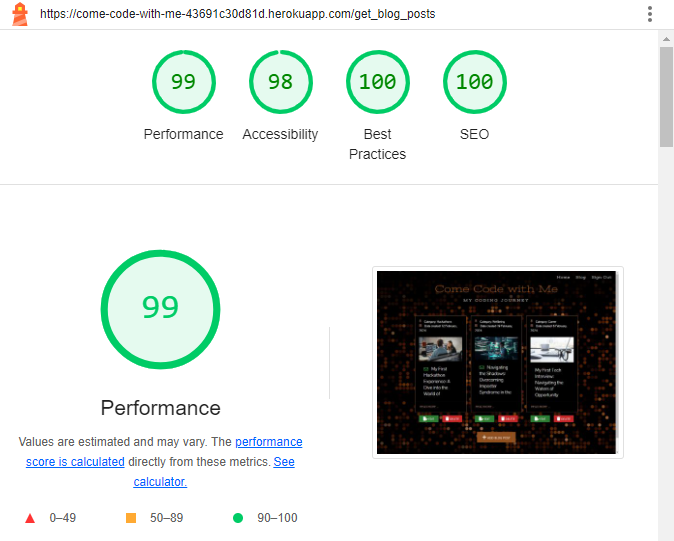 | Some minor warnings |
| Read Post | Mobile | 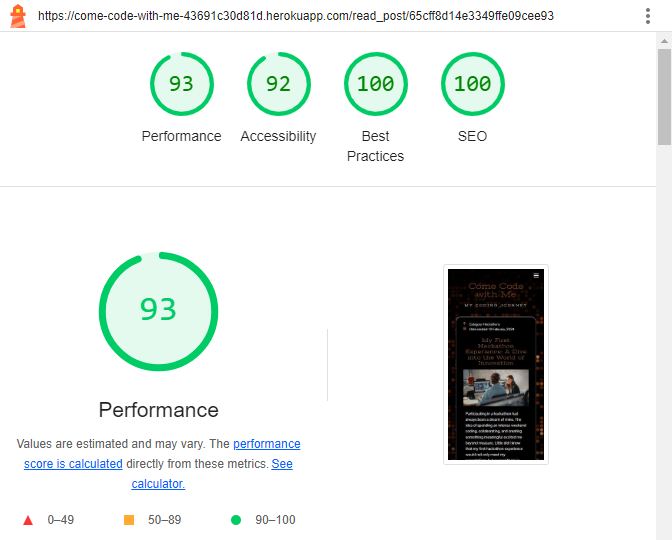 | Some minor warnings |
| Read Post | Desktop | 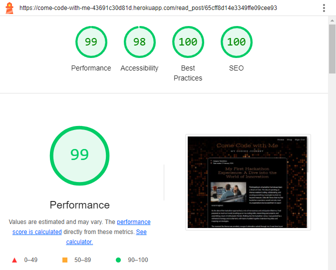 | Some minor warnings |
| Add Blog Post | Mobile | 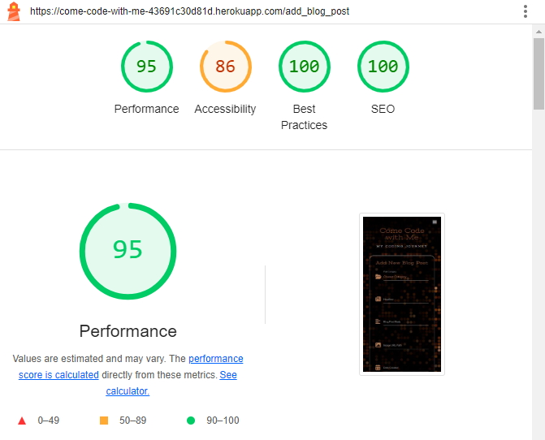 | Few warnings |
| Add Blog Posst | Desktop | 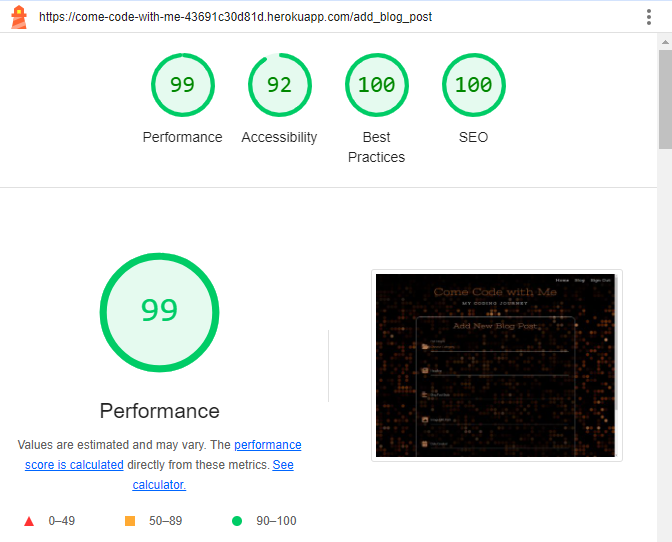 | Some minor warnings |
| Edit Blog Post | Mobile | 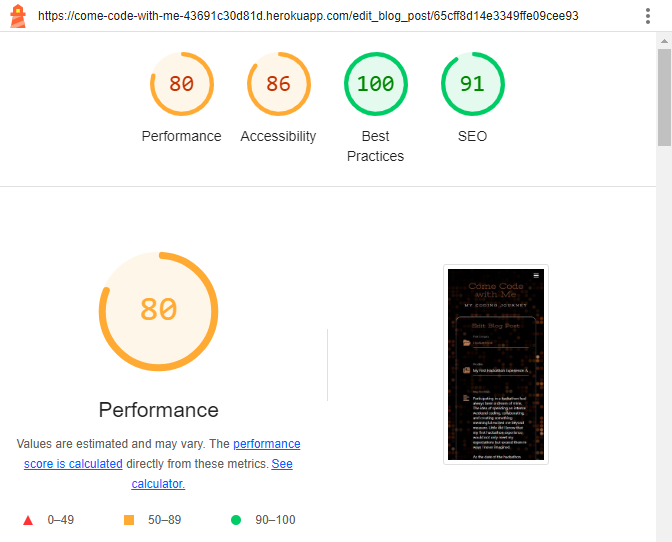 | Few warnings |
| Edit Blog Post | Desktop | 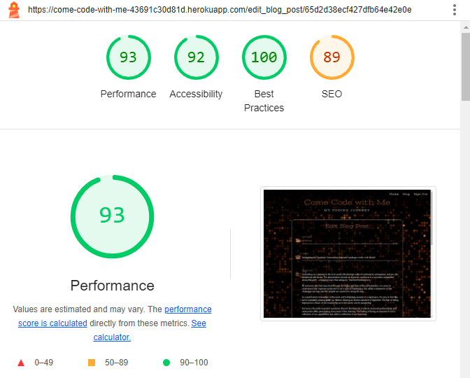 | Few warnings |

## User Stories Testing

### Client Goals

| User Stories | Completed? |
| --- | --- |
| As a client, I would like to provide users with accurate and up-to-date information about the current phase of the Moon. This could include displaying the Moon's appearance, percentage of illumination, distance to the Moon from Earth, and other relevant details. | ✔️ |
| As a client, I would like to educate users about the different phases of the Moon and the science behind them. It could provide explanations, diagrams, and relevant images to help users understand the lunar cycle. | ✔️ |
| As a client, I would like to provide a visual calendar that displays the Moon phases for a specific period (e.g., a year) that can help users track the Moon's changing appearance over time. | ✔️ |
| As a client, I would like to deliver all of the above in the form of a visually appealing, intuitive, responsive across different devices and easy to navigate website. | ✔️ |

### First Time User Goals

| User Stories | Completed? |
| --- | --- |
| As a first time user, I should be able to quickly and easily see the current phase of the Moon, whether it's a Full Moon, New Moon, Waxing Crescent, Waning Gibbous, etc. | ✔️ |
| As a first time user, I should be able to access more than just the current Moon Phase. I should be able to see additional information such as Moon illumination percentage, number of days through the cycle, number of days till the next Full Moon, etc. | ✔️ |
| As a first time user, I should be able to explore a calendar view that shows the Moon's phases for a specific period, helping me understand how the Moon's appearance changes over time. | ✔️ |
| As a first time user, I should be able to learn about the different phases of the Moon, their significance and why the Moon's appearance changes over time. | ✔️ |
| As a first time user, I should be able to navigate throughout the page in an easy, effortless and intuitive way. | ✔️ |
| As a first time user, I should be able to have a positive and enjoyable experience while browsing the website. | ✔️ |

### Returning/Frequent User Goals

| User Stories | Completed? |
| --- | --- |
| As a returning/frequent user, I should be able to continue tracking the Moon's changing phases to deepen my understanding of the Lunar Cycle. | ✔️ |
| As a returning/frequent user, I should be able to plan upcoming activities that align with specific Moon phases, such as outdoor events, photography sessions, or astronomical observations. | ✔️ |
| As a returning/frequent user, I should be able to revisit the website's settings to fine-tune my preferences, such as adjusting my time zone or choosing my favorite locations. | Take a look at the Future Implementations section in [README.md](README.md) file. |
| As a returning/frequent user, I should be able to share my own observations, photos, or experiences related to Moon phases within the website's community. | Take a look at the Future Implementations section in [README.md](README.md) file. |
| As a returning/frequent user, I should be able to stay informed about upcoming celestial events beyond Moon phases, such as meteor showers, planetary alignments, asteroids and comets. | Take a look at the Future Implementations section in [README.md](README.md) file. |
| As a returning/frequent user, I should be able to access the provider's social media accounts. | ✔️ |
| As a returning/frequent user, I should be able to offer feedback to the app developers based on my experiences, helping to shape future updates and improvements. | Take a look at the Future Implementations section in [README.md](README.md) file. |
