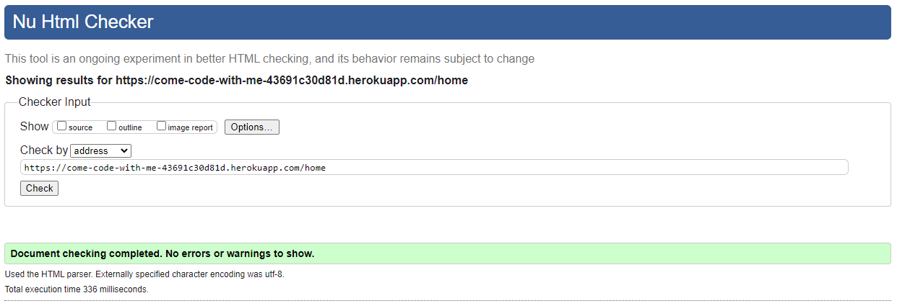
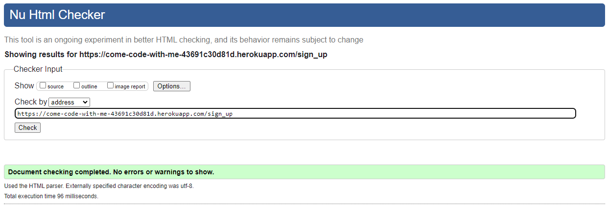
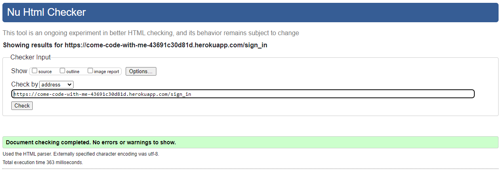
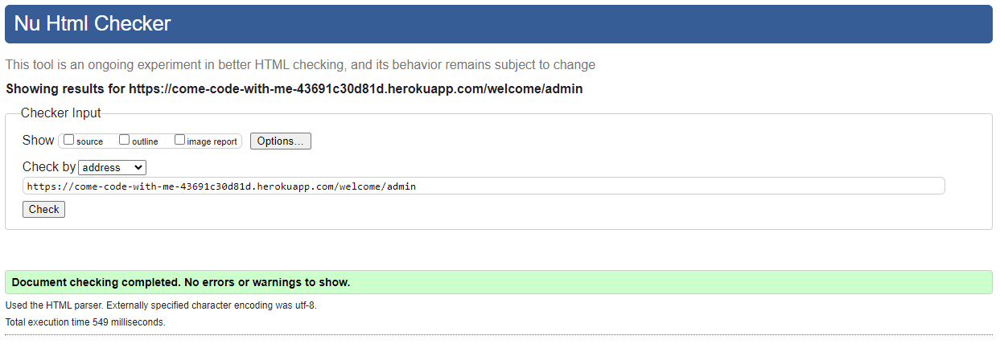
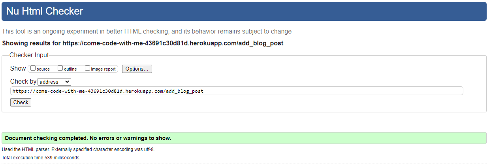
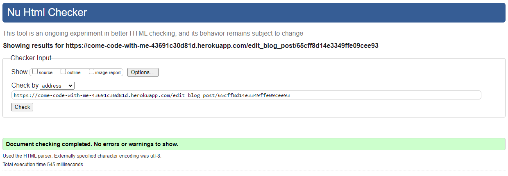
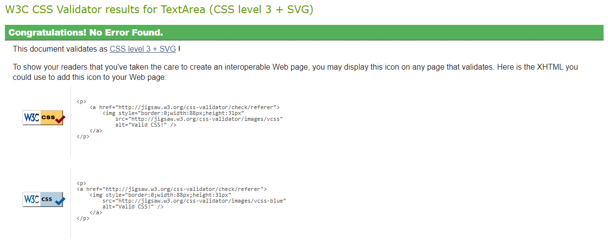
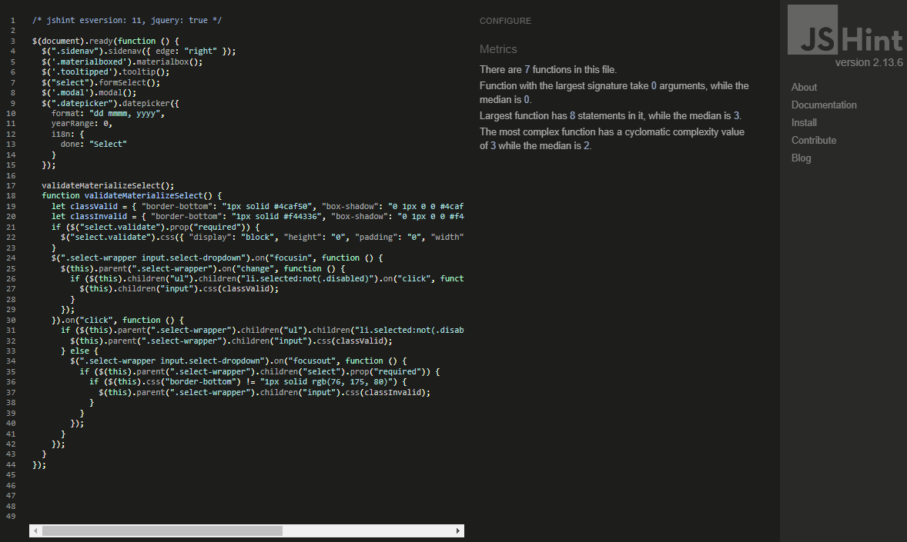

# Testing

Return back to the [README.md](README.md) file.

## Code Validation

[The W3C Markup Validation Service](https://validator.w3.org/) and [The W3C CSS Validation Service](https://jigsaw.w3.org/css-validator/) were used to validate every page of the project to ensure there were no syntax errors. The results clearly showed that the website stays in compliance with the standards and recommendations set by the World Wide Web Consortium.

[JSLint](https://www.jslint.com/), a static code analysis tool, was used to check if JavaScript source code complies with coding rules. No errors were found in this area.

### HTML Validation

I have used the recommended [HTML W3C Validator](https://validator.w3.org) to validate all of my HTML files. No errors were found when validating them by URI. 

| Page | W3C URL | Screenshot | Notes |
| --- | --- | --- | --- |
| Home | [W3C](https://validator.w3.org/nu/?doc=https%3A%2F%2Fcome-code-with-me-43691c30d81d.herokuapp.com%2Fhome) |  | Pass: No Errors |
| Sign Up | [W3C](https://validator.w3.org/nu/?doc=https%3A%2F%2Fcome-code-with-me-43691c30d81d.herokuapp.com%2Fsign_up) |  | Pass: No Errors |
| Sign In | [W3C](https://validator.w3.org/nu/?doc=https%3A%2F%2Fcome-code-with-me-43691c30d81d.herokuapp.com%2Fsign_in) |  | Pass: No Errors |
| Welcome | [W3C](https://validator.w3.org/nu/?doc=https%3A%2F%2Fcome-code-with-me-43691c30d81d.herokuapp.com%2Fwelcome%2Fadmin) |  | Pass: No Errors |
| Blog | [W3C](https://validator.w3.org/nu/?doc=https%3A%2F%2Fcome-code-with-me-43691c30d81d.herokuapp.com%2Fget_blog_posts) |  | Pass: No Errors |
| Read Blog Post | [W3C](https://validator.w3.org/nu/?doc=https%3A%2F%2Fcome-code-with-me-43691c30d81d.herokuapp.com%2Fread_post%2F65cff8d14e3349ffe09cee93) |  | Pass: No Errors |
| Add Blog Post | [W3C](https://validator.w3.org/nu/?doc=https%3A%2F%2Fcome-code-with-me-43691c30d81d.herokuapp.com%2Fadd_blog_post) |  | Pass: No Errors |
| Edit Blog Post | [W3C](https://validator.w3.org/nu/?doc=https%3A%2F%2Fcome-code-with-me-43691c30d81d.herokuapp.com%2Fedit_blog_post%2F65cff8d14e3349ffe09cee93) |  | Pass: No Errors |

To properly validate HTML pages with Jinja syntax for authenticated pages, I also utilized the "by input" validation method. It resulted in an error stating: "The `<button>` element must not appear as a descendant of an `<a>` element." It resulted in restructurring the affected buttons accordingly. Additionally, the validation flagged an issue indicating that a `
` element is not allowed as a child of a `` element. However, I chose to disregard this suggestion because there is physically no `
` element within the `` element where the issue was identified. The `
` element serves as a modal displayed upon clicking the `` element.

### CSS Validation

I have used the recommended [CSS Jigsaw Validator](https://jigsaw.w3.org/css-validator) to validate my CSS file. No errors were found.

| File | Jigsaw URL | Screenshot | Notes |
| --- | --- | --- | --- |
| style.css | [Jigsaw](https://jigsaw.w3.org/css-validator) |  | Pass: No Errors |

### JS Lint Testing

I have used [JSHint](https://jshint.com/) to identify potential errors in my JavaScript file. No errors were found.

| File | Screenshot | Notes |
| --- | --- | --- |
| script.js |  | No errors found