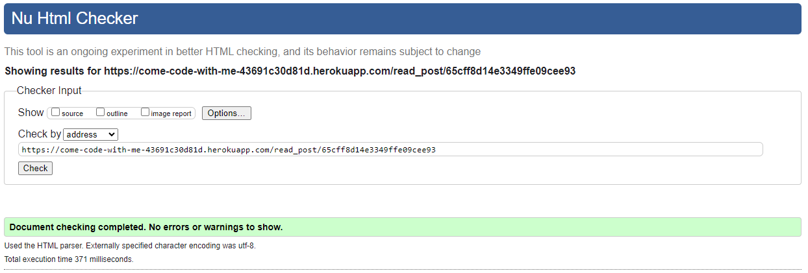
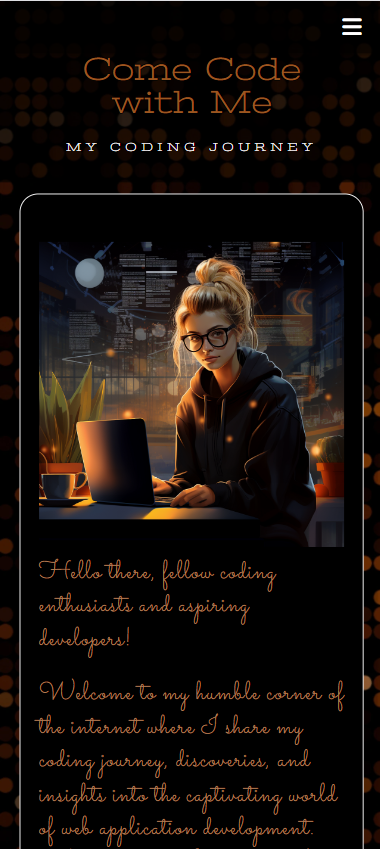

# Testing

Return back to the [README.md](README.md) file.

## Introduction

Software testing is a common practice and a crucial step in the development process that ensures the quality, functionality and reliability of a web application. There are two primary approaches to testing - manual and automated. They both play vital roles in the process.

Both manual and automated testing have their strengths and limitations, but let's focus on the strengths. Manual testing offers flexibility and human insight, while automated testing provides efficiency and repeatability. Combining these two approaches can help achieve comprehensive test coverage.

### Manual Testing

Manual Testing involves human testers who interact with the software and assess its behavior against predefined criteria. This method relies on the tester's intuition, experience, and creativity to identify defects, making it particularly effective in exploratory testing and scenarios where user interaction is complex or subjective. 

"Come Code with Me" has been tested manually to check if the project works according to the user stories, to check its performance in different browsers and to check its responsiveness at different resolutions. Some friends and family members were invited to test the app on their devices and to check for potential functionality issues.

### Automated Testing

Automated Testing, on the other hand, employs specialized testing tools and scripts to automate the execution of test cases and verification of results. It excels in repetitive, time-consuming, and regression testing scenarios, where the same tests need to be run repeatedly to ensure new code changes do not introduce defects. 

All tests described and documented in the Code Validation and the Lighthouse Audit sections are automated tests.

## Code Validation

[The W3C Markup Validation Service](https://validator.w3.org/) and [The W3C CSS Validation Service](https://jigsaw.w3.org/css-validator/) were used to validate every page of the project to ensure there were no syntax errors. The results clearly showed that the website stays in compliance with the standards and recommendations set by the World Wide Web Consortium.

[JSLint](https://www.jslint.com/), a static code analysis tool, was used to check if JavaScript source code complies with coding rules. No errors were found in this area.

### HTML Validation

I have used the recommended [HTML W3C Validator](https://validator.w3.org) to validate all of my HTML files. No errors were found when validating them by URI. 

| Page | W3C URL | Screenshot | Notes |
| --- | --- | --- | --- |
| Home | [W3C](https://validator.w3.org/nu/?doc=https%3A%2F%2Fcome-code-with-me-43691c30d81d.herokuapp.com%2Fhome) |  | Pass: No Errors |
| Sign Up | [W3C](https://validator.w3.org/nu/?doc=https%3A%2F%2Fcome-code-with-me-43691c30d81d.herokuapp.com%2Fsign_up) |  | Pass: No Errors |
| Sign In | [W3C](https://validator.w3.org/nu/?doc=https%3A%2F%2Fcome-code-with-me-43691c30d81d.herokuapp.com%2Fsign_in) |  | Pass: No Errors |
| Welcome | [W3C](https://validator.w3.org/nu/?doc=https%3A%2F%2Fcome-code-with-me-43691c30d81d.herokuapp.com%2Fwelcome%2Fadmin) |  | Pass: No Errors |
| Blog | [W3C](https://validator.w3.org/nu/?doc=https%3A%2F%2Fcome-code-with-me-43691c30d81d.herokuapp.com%2Fget_blog_posts) |  | Pass: No Errors |
| Read Blog Post | [W3C](https://validator.w3.org/nu/?doc=https%3A%2F%2Fcome-code-with-me-43691c30d81d.herokuapp.com%2Fread_post%2F65cff8d14e3349ffe09cee93) |  | Pass: No Errors |
| Add Blog Post | [W3C](https://validator.w3.org/nu/?doc=https%3A%2F%2Fcome-code-with-me-43691c30d81d.herokuapp.com%2Fadd_blog_post) |  | Pass: No Errors |
| Edit Blog Post | [W3C](https://validator.w3.org/nu/?doc=https%3A%2F%2Fcome-code-with-me-43691c30d81d.herokuapp.com%2Fedit_blog_post%2F65cff8d14e3349ffe09cee93) |  | Pass: No Errors |

To properly validate HTML pages with Jinja syntax for authenticated pages, I also utilized the "by input" validation method. It resulted in an error stating: "The `<button>` element must not appear as a descendant of an `<a>` element." It resulted in restructurring the affected buttons accordingly. Additionally, the validation flagged an issue indicating that a `
` element is not allowed as a child of a `` element. However, I chose to disregard this suggestion because there is physically no `
` element within the `` element where the issue was identified. The `
` element serves as a modal displayed upon clicking the `` element.

### CSS Validation

I have used the recommended [CSS Jigsaw Validator](https://jigsaw.w3.org/css-validator) to validate my CSS file. No errors were found.

| File | Jigsaw URL | Screenshot | Notes |
| --- | --- | --- | --- |
| style.css | [Jigsaw](https://jigsaw.w3.org/css-validator) |  | Pass: No Errors |

### JS Hint Testing

I have used [JSHint](https://jshint.com/) to identify potential errors in my JavaScript file. No errors were found.

| File | Screenshot | Notes |
| --- | --- | --- |
| script.js |  | No errors found |

### Python Testing

I have used the recommended [PEP8 CI Python Linter](https://pep8ci.herokuapp.com) to validate my Python file.

| File | Screenshot | Notes |
| --- | --- | --- |
| app.py |  | No errors found |

## Browser Compatibility

I have tested my deployed project on multiple browsers to check for compatibility issues.

| Browser | Screenshot | Notes |
| --- | --- | --- |
| Chrome |  | Works as expected |
| Firefox |  | Works as expected |
| Edge |  | Works as expected |
| Opera |  | Works as expected |

## Responsiveness

I have tested my deployed project on multiple devices to check for responsiveness issues. It responds well to different screen sizes ensuring that users can access and navigate the content effortlessly, regardless of their chosen device. No design or functionality issues were found.

| Device | Screenshot 1 | Screenshot 2 | Screenshot 3 | Notes |
| --- | --- | --- | --- | --- |
| Mobile (DevTools) |  |  |  | Works as expected |
| Tablet (DevTools) |  |  |  | Works as expected |
| Desktop |  |  |  | Works as expected |

## Lighthouse Audit

I have tested my deployed project using the Lighthouse Audit tool to check for any major issues. 

| Page | Size | Screenshot | Notes |
| --- | --- | --- | --- |
| Home | Mobile |  | Few warnings |
| Home | Desktop |  | Some minor warnings |
| Welcome | Mobile |  | Few warnings |
| Welcome | Desktop |  | Some minor warnings |
| Sign Up | Mobile |  | Some minor warnings |
| Sign Up | Desktop |  | Some minor warnings |
| Sign In | Mobile |  | Some minor warnings |
| Sign In | Desktop |  | Some minor warnings |
| Blog Posts | Mobile |  | Some minor warnings |
| Blog Posts | Desktop |  | Some minor warnings |
| Read Post | Mobile |  | Some minor warnings |
| Read Post | Desktop |  | Some minor warnings |
| Add Blog Post | Mobile |  | Few warnings |
| Add Blog Posst | Desktop |  | Some minor warnings |
| Edit Blog Post | Mobile |  | Few warnings |
| Edit Blog Post | Desktop |  | Few warnings |

## User Stories Testing

### Client Goals

| User Stories | Completed? |
| --- | --- |
| As a client, I would like to document my coding journey, track my progress, and reflect on my experiences as I learn and grow in web app development. | ✔️ |
| As a client, I would like to showcase my personal projects and coding challenges to demonstrate my skills, creativity, and problem-solving abilities to potential employers, collaborators, and the broader tech community. | ✔️ |
| As a client, I would like to share my insights and discoveries in web app development and emerging technologies with others in the field, contributing to the community and encouraging knowledge exchange. | ✔️ |
| As a client, I would like to connect with other students, developers, mentors, and professionals in the tech industry, fostering meaningful relationships, mentorship, and potential collaboration on projects or initiatives. | ✔️ |
| As a client, I would like to seek feedback, advice, and support from my audience, peers, and mentors to improve my coding skills, overcome challenges, and navigate my career path in web app development effectively. | ✔️ |
| As a client, I would like to inspire and motivate other aspiring developers by sharing my experiences, successes, failures, and lessons learned along my coding journey. | ✔️ |
| As a client, I would like to build and enhance my personal brand as a competent and passionate web app developer, showcasing my portfolio, achievements, and expertise to potential employers and collaborators. | ✔️ |
| As a client, I would like to attract job opportunities, internships, freelance projects, and career advancement opportunities through my blog, using it as a tool to market my skills, experience, and potential to prospective employers and recruiters. | ✔️ |
| As a client, I would like to promote continuous learning, experimentation, and exploration of new technologies, frameworks, tools, and methodologies in web app development, enabling me to stay updated and adapt to the evolving landscape of the tech industry. | ✔️ |
| As a client, I would like to deliver all of the above in the form of a visually appealing, intuitive, responsive across different devices and easy to navigate website. | ✔️ |

### First Time User Goals

| User Stories | Completed? |
| --- | --- |
| As a first time user, I should be able to understand the purpose and focus of the website, including the student's goals, interests, areas of expertise, and the type of content I can expect to find. | ✔️ |
| As a first time user, I should be able to learn more about the student behind the blog, including their background, interests, skills, achievements, and the story behind their coding journey. | ✔️ |
| As a first time user, I should be able to connect with the student through social media, or other channels, providing feedback, asking questions, sharing my own experiences, or expressing interest in potential collaborations. | ✔️ |
| As a first time user, I should be able to find inspiration, insights, and valuable information that can help me learn more about web app development, coding best practices, new technologies, and industry trends. | ✔️ |
| As a first time user, I should be able to access resources, tools, tutorials, guides, and other educational materials that can help me improve my coding skills, learn new technologies, and advance my career in web app development. | ✔️ |
| As a first time user, I should be able to navigate throughout the page and access relevant content in an easy, effortless and intuitive way. | ✔️ |
| As a first time user, I should be able to interact with the website's content seamlessly across different devices and screen sizes. | ✔️ |
| As a first time user, I should be able to have a positive and enjoyable experience while browsing the website. | ✔️ |

### Returning User Goals

| User Stories | Completed? |
| --- | --- |
| As a returning user, I should be able to access new blog posts, projects, articles, or updates since my last visit. | Take a look at the Future Implementations section in [README.md](README.md) file. |
| As a returning user, I should be able to engage continuously with the website's content by commenting on blog posts, asking questions, or participating in discussions related to coding topics and industry trends. | Take a look at the Future Implementations section in [README.md](README.md) file. |
| As a returning user, I should be able to offer feedback based on my experiences, helping to shape future updates and improvements. | ✔️ |

### Frequent User Goals

| As a frequent user, I should be able to stay updated with the latest content, projects, and insights shared by the student on their coding journey. | Take a look at the Future Implementations section in [README.md](README.md) file. |
| As a frequent user, I should be able to stay connected with the student and the community around the blog, including subscribing to newsletters, following social media updates, or joining forums or groups related to web app development. | Take a look at the Future Implementations section in [README.md](README.md) file. |
| As a frequent user, I should be able to find solutions to specific coding challenges, troubleshoot issues, or learn new techniques and strategies in web app development based on my ongoing projects or interests. | Take a look at the Future Implementations section in [README.md](README.md) file. |
| As a frequent user, I should be able to provide feedback, suggestions, or recommendations to help improve the website's content, user experience, navigation, or functionality, contributing to its continuous improvement and development. | Take a look at the Future Implementations section in [README.md](README.md) file. |

## Fixed Bugs

## Unfixed Bugs